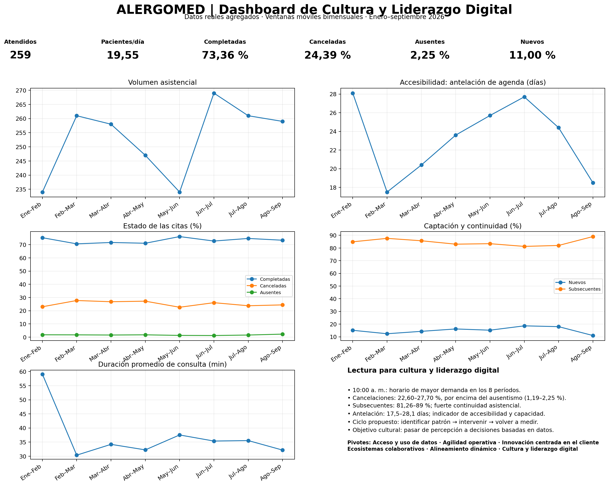

Portafolio AlergoMed como Boundary Object
Introducción

AlergoMed es una clínica especializada en Alergología que busca brindar una atención integral, personalizada y centrada en el paciente. Como parte de su evolución, considero importante integrar la práctica clínica con herramientas de gestión, transformación digital, análisis de datos e inteligencia artificial.

Desde esta perspectiva, el portafolio de iniciativas de AlergoMed puede entenderse como un Boundary Object (objeto frontera), ya que permite que diferentes actores puedan trabajar alrededor de una misma visión, aunque cada uno tenga conocimientos, responsabilidades y perspectivas diferentes.

El portafolio deja de ser solamente una lista de proyectos y se convierte en un punto de encuentro entre la práctica clínica, la administración, la tecnología, los datos y las necesidades del paciente.

Objetivo del portafolio

Organizar y priorizar las iniciativas de AlergoMed de manera que contribuyan a mejorar la atención y experiencia del paciente, optimizar los procesos internos, aprovechar mejor la información disponible e incorporar progresivamente nuevas tecnologías, manteniendo siempre el criterio clínico y la relación médico-paciente como elementos fundamentales.

## Portafolio de iniciativas de AlergoMed

| Iniciativa | Perspectiva clínica | Perspectiva administrativa | Tecnología / Datos | Valor para el paciente | Aporte estratégico |
|---|---|---|---|---|---|
| **Expediente clínico y datos estructurados** | Mejor información para diagnóstico y seguimiento | Facilita organización y acceso a la información | Datos estructurados e interoperabilidad | Continuidad y personalización de la atención | Desarrollar una cultura basada en datos |
| **Seguimiento inteligente del paciente alérgico** | Identificar evolución, adherencia y necesidad de controles | Facilitar programación y seguimiento | Alertas, automatización y análisis de datos | Mayor acompañamiento y continuidad | Mejorar resultados y fidelización |
| **Optimización de citas y recordatorios** | Disminuir pérdida de controles importantes | Reducir ausentismo y optimizar agendas | Automatización de confirmaciones y recordatorios | Mayor facilidad de acceso y organización | Mejorar la eficiencia operativa |
| **Educación personalizada al paciente** | Reforzar indicaciones, prevención y adherencia | Estandarizar material educativo | Contenido digital personalizado | Mayor conocimiento y participación en su enfermedad | Fortalecer la atención centrada en el paciente |
| **Inmunoterapia y seguimiento longitudinal** | Evaluar respuesta, seguridad y adherencia | Control de citas, aplicaciones y continuidad | Registro y análisis de la evolución | Tratamiento más seguro y personalizado | Fortalecer una línea central de atención de AlergoMed |
| **Telemedicina y seguimiento virtual** | Facilitar controles seleccionados | Ampliar alternativas de atención | Plataformas digitales y comunicación segura | Acceso más sencillo y oportuno | Ampliar el modelo de atención |
| **Analítica de datos clínicos** | Identificar patrones de enfermedad y respuesta terapéutica | Conocer demanda y comportamiento de la consulta | Indicadores, dashboards y análisis de tendencias | Mejora progresiva de la calidad asistencial | Apoyar decisiones basadas en evidencia |
| **Inteligencia artificial** | Apoyar el análisis y la toma de decisiones sin sustituir el criterio médico | Automatizar tareas repetitivas | IA y análisis predictivo | Atención potencialmente más eficiente y personalizada | Innovación y diferenciación de AlergoMed |
| **Investigación clínica** | Generar conocimiento y evaluar resultados | Organizar protocolos y procesos | Captura y análisis estructurado de datos | Acceso a innovación y conocimiento actualizado | Fortalecer el posicionamiento científico |
| **Experiencia integral del paciente** | Atención humana, coordinada y personalizada | Mejorar el recorrido del paciente | Integración de herramientas digitales | Mejor experiencia antes, durante y después de la consulta | Diferenciación y fortalecimiento de AlergoMed |

¿Por qué el portafolio funciona como un Boundary Object?

El valor del portafolio como Boundary Object está en que permite que diferentes actores observen las mismas iniciativas desde sus propias perspectivas.

Desde mi posición como médica, puedo valorar principalmente el beneficio clínico y el impacto sobre los resultados del paciente. El área administrativa puede analizar la eficiencia de los procesos y los recursos necesarios. Tecnología puede evaluar los datos, la integración de sistemas y la factibilidad de las soluciones digitales. Por su parte, el paciente percibe el resultado final a través de una atención más accesible, personalizada, coordinada y eficiente.

Aunque cada actor tenga una interpretación diferente, todos pueden utilizar el mismo portafolio como referencia para comunicarse, establecer prioridades y tomar decisiones.

De esta manera:

Clínica + Administración + Tecnología + Datos + Paciente → Portafolio AlergoMed → Estrategia

Inteligencia artificial dentro del portafolio

La incorporación de inteligencia artificial en AlergoMed no debe entenderse como un objetivo aislado ni como la implementación de tecnología simplemente por innovar.

Su verdadero valor estaría en utilizarla para apoyar actividades como el análisis de información, identificación de patrones, seguimiento de pacientes, automatización de procesos y generación de información que facilite la toma de decisiones.

La inteligencia artificial debe funcionar como una herramienta complementaria. No pretende sustituir el criterio clínico, la empatía ni la relación médico-paciente, sino contribuir a que estos elementos puedan desarrollarse dentro de un modelo de atención más organizado, eficiente y personalizado.

Conclusión

Considero que visualizar el portafolio de AlergoMed como un Boundary Object permite integrar iniciativas que anteriormente podrían analizarse de manera independiente.

El portafolio proporciona un lenguaje común para conectar la atención clínica, la gestión administrativa, los datos, la tecnología y la experiencia del paciente con los objetivos estratégicos de la clínica.

De esta forma, la transformación digital deja de ser únicamente un proyecto tecnológico y pasa a formar parte de una estrategia integral orientada a generar valor para el paciente y para AlergoMed.

El portafolio de AlergoMed funciona como un puente que conecta diferentes perspectivas alrededor de un mismo propósito: ofrecer una atención de calidad, personalizada, eficiente y centrada en el paciente.

# 📊 Dashboard de Cultura y Liderazgo Digital – AlergoMed

## 🏥 Contexto

Para esta actividad decidí trabajar con **AlergoMed**, clínica especializada en Alergología, utilizando datos reales y agregados provenientes de la gestión cotidiana de citas de nuestros pacientes.

El objetivo es transformar datos que normalmente se generan durante la operación diaria en información útil para la toma de decisiones.

Desde mi perspectiva, la cultura y el liderazgo digital no consisten únicamente en incorporar tecnología, sino en desarrollar la capacidad de utilizar los datos disponibles para comprender mejor lo que ocurre en la organización, identificar oportunidades de mejora y tomar decisiones basadas en evidencia.

### Datos → Información → Decisión → Intervención → Medición

---

# 🎯 Objetivo del dashboard

Desarrollar una propuesta de indicadores que permita visualizar información relevante de AlergoMed relacionada con:

- Actividad asistencial.
- Utilización de la agenda.
- Accesibilidad.
- Cancelaciones y ausentismo.
- Captación de pacientes nuevos.
- Continuidad de pacientes subsecuentes.
- Patrones de días y horarios.
- Calidad y completitud de los datos.

El propósito final es utilizar esta información para apoyar una gestión más eficiente y fortalecer una **cultura organizacional basada en datos**.

---

# 📝 Instrumento para identificar dominios y productos de datos

Para identificar los datos disponibles en AlergoMed se propone utilizar un cuestionario breve mediante conversaciones con las personas involucradas en la gestión clínica, administrativa y tecnológica.

### Cuestionario

1. ¿Qué datos se generan diariamente durante la atención y programación de citas?
2. ¿Dónde se almacenan actualmente esos datos?
3. ¿Quiénes tienen acceso a la información?
4. ¿Con qué frecuencia se actualizan los datos?
5. ¿Qué tan completos son los registros?
6. ¿Qué información utilizamos actualmente para tomar decisiones?
7. ¿Qué datos tenemos disponibles pero todavía no analizamos sistemáticamente?
8. ¿Qué procesos de agenda continúan realizándose manualmente?
9. ¿Qué indicadores permitirían mejorar la utilización de la agenda?
10. ¿Qué información permitiría mejorar la experiencia del paciente?
11. ¿Qué datos podrían ayudarnos a comprender mejor las cancelaciones y ausencias?
12. ¿Qué información debería visualizar la dirección de AlergoMed para tomar decisiones más oportunas?

---

# 🗂️ Dominios y productos de datos

| Dominio | Producto de datos | Datos disponibles | Utilidad |
|---|---|---|---|
| Pacientes | Perfil de atención | Nuevos y subsecuentes | Analizar captación y continuidad |
| Citas | Gestión de agenda | Completadas, canceladas y ausentes | Evaluar utilización de agenda |
| Demanda | Patrones de agendamiento | Día y horario de mayor demanda | Adaptar disponibilidad |
| Accesibilidad | Tiempo de espera | Antelación promedio para agendar | Evaluar acceso a consulta |
| Actividad asistencial | Capacidad de atención | Pacientes atendidos y promedio diario | Planificar capacidad |
| Tiempo | Uso de consulta | Duración promedio | Analizar utilización del tiempo |
| Cancelaciones | Patrones de cancelación | Día y horario | Diseñar acciones focalizadas |
| Ausentismo | Patrones de no asistencia | Día y horario | Mejorar confirmaciones |
| Calidad del dato | Completitud | Campos no completados | Mejorar confiabilidad |

---

# 🔄 Seis pivotes de la evolución digital

Aunque la consigna hace referencia a cinco pivotes, el material del curso presenta **seis pivotes de evolución digital**, por lo que para este análisis se utilizaron los seis.

| Pivote | Aplicación en AlergoMed | Datos / indicadores | Decisión que permite |
|---|---|---|---|
| **Acceso y uso de datos** | Transformar registros en información | KPI del dashboard | Tomar decisiones basadas en datos |
| **Agilidad operativa** | Optimizar agenda y capacidad | Pacientes/día, duración, cancelaciones y ausencias | Ajustar horarios y procesos |
| **Innovación centrada en el cliente** | Comprender preferencias del paciente | Antelación, días y horarios | Adaptar disponibilidad |
| **Ecosistemas colaborativos** | Compartir información clínica y administrativa | Dashboard integrado | Facilitar decisiones coordinadas |
| **Alineamiento dinámico** | Responder a cambios en demanda | Evolución temporal de KPI | Ajustar decisiones oportunamente |
| **Cultura y liderazgo digital** | Incorporar datos a la gestión cotidiana | KPI y calidad del dato | Pasar de percepción a decisiones informadas |

---

# 🔗 Alineamiento con la estrategia de AlergoMed

Considero que existe un **alineamiento entre los datos disponibles y el modelo de atención de AlergoMed**, aunque también existe una oportunidad para evolucionar hacia un uso más estratégico de la información.

Los datos generados están directamente relacionados con:

- accesibilidad;
- continuidad asistencial;
- utilización de la agenda;
- eficiencia operativa;
- comportamiento de los pacientes;
- experiencia del paciente.

El dashboard permite transformar registros que originalmente tienen una función operativa en un **producto de datos con utilidad estratégica**.

De esta manera, los sistemas de información dejan de utilizarse únicamente para registrar lo que ocurrió y comienzan también a utilizarse para comprender tendencias y apoyar decisiones.

---

# 📊 Fuente de los datos

Para este proyecto decidí utilizar **datos reales de AlergoMed** y no el set de datos generado por el curso.

Los datos corresponden a métricas agregadas de citas entre **enero y septiembre de 2026**, organizadas mediante ventanas móviles bimensuales.

Los períodos analizados son:

**Ene–Feb → Feb–Mar → Mar–Abr → Abr–May → May–Jun → Jun–Jul → Jul–Ago → Ago–Sep**

Debido a que estas ventanas se superponen, los pacientes de los diferentes períodos **no deben sumarse como si correspondieran a cohortes independientes**.

Los datos utilizados son agregados y no contienen información que permita identificar individualmente a los pacientes.

---

# 📈 Indicadores seleccionados

| Indicador | ¿Qué mide? | ¿Por qué medirlo? | Impacto |
|---|---|---|---|
| Pacientes atendidos | Volumen asistencial | Conocer demanda | Planificar capacidad |
| Pacientes/día | Intensidad diaria | Evaluar carga asistencial | Optimizar agenda |
| % completadas | Utilización efectiva | Conocer aprovechamiento | Mejor eficiencia |
| % canceladas | Cancelación de citas | Identificar espacios liberados | Mejorar reprogramación |
| % ausentes | No-show | Detectar inasistencia | Diseñar recordatorios |
| % nuevos | Captación | Evaluar nuevos pacientes | Seguimiento del crecimiento |
| % subsecuentes | Continuidad | Evaluar seguimiento | Fortalecer continuidad |
| Antelación | Accesibilidad | Conocer tiempo para obtener cita | Gestionar capacidad |
| Duración promedio | Tiempo de consulta | Analizar utilización del tiempo | Planificar agenda |
| Día/horario solicitado | Preferencias | Conocer patrones de demanda | Adaptar disponibilidad |
| Día/horario de cancelación | Comportamiento | Identificar patrones | Intervenciones dirigidas |
| Día/horario de ausencia | No asistencia | Identificar patrones | Confirmaciones focalizadas |
| Completitud | Calidad del dato | Evaluar confiabilidad | Fortalecer cultura de datos |

---

# 📋 Ejemplo de los datos utilizados

| Período | Atendidos | Pac./día | Completadas | Canceladas | Ausentes | Nuevos | Subsecuentes | Antelación |
|---|---:|---:|---:|---:|---:|---:|---:|---:|
| Ene–Feb | 234 | 15,64 | 75,27% | 22,98% | 1,75% | 15,12% | 84,88% | 28,1 días |
| Feb–Mar | 261 | 24,59 | 70,61% | 27,70% | 1,69% | 12,40% | 87,60% | 17,5 días |
| Mar–Abr | 258 | 21,68 | 71,65% | 26,78% | 1,57% | 14,30% | 85,70% | 20,4 días |
| Abr–May | 247 | 20,61 | 71,07% | 27,20% | 1,72% | 16,18% | 83,02% | 23,6 días |
| May–Jun | 234 | 18,74 | 76,12% | 22,60% | 1,28% | 15,20% | 83,40% | 25,7 días |
| Jun–Jul | 269 | 21,35 | 72,74% | 26,06% | 1,19% | 18,63% | 81,26% | 27,7 días |
| Jul–Ago | 261 | 22,59 | 74,71% | 23,74% | 1,56% | 18,00% | 82,00% | 24,4 días |
| Ago–Sep | 259 | 19,55 | 73,36% | 24,39% | 2,25% | 11,00% | 89,00% | 18,5 días |

---

# 🔎 Principales hallazgos

El análisis inicial permite identificar varios patrones relevantes.

### 🕙 Horario de mayor demanda

Las **10:00 a. m. fueron el horario de mayor demanda en los ocho períodos analizados**.

Este patrón puede utilizarse para orientar la distribución de la disponibilidad de agenda de acuerdo con las preferencias observadas de los pacientes.

### 📅 Cancelaciones

Las cancelaciones se encuentran aproximadamente entre **22,60% y 27,70%**.

En comparación, el ausentismo se encuentra entre aproximadamente **1,19% y 2,25%**.

Por lo tanto, las cancelaciones representan una oportunidad de gestión más importante que el no-show.

Esto podría orientar estrategias como:

- confirmación anticipada;
- reprogramación digital;
- listas de espera;
- aprovechamiento de espacios liberados.

### 👥 Continuidad asistencial

Los pacientes subsecuentes representan aproximadamente entre **81% y 89%** de los pacientes atendidos.

Esto refleja un componente importante de **continuidad asistencial**, característica relevante en el seguimiento de pacientes con enfermedades alérgicas.

### ⏳ Accesibilidad

La antelación para obtener una cita varió entre **17,5 y 28,1 días**.

Este indicador puede utilizarse para vigilar cambios en:

- demanda;
- disponibilidad;
- capacidad de agenda;
- accesibilidad de los pacientes.

### 🗃️ Calidad del dato

También se incorporó la completitud de los registros como indicador.

Esto es importante porque una organización puede disponer de grandes cantidades de información, pero si los datos no son completos y confiables, su utilidad para tomar decisiones disminuye.

---

# 🧠 Impacto sobre la cultura y liderazgo digital

El dashboard permite cambiar la manera en que se discuten los problemas de gestión.

En lugar de preguntar:

**“¿Cómo sentimos que está funcionando la agenda?”**

podemos comenzar a preguntar:

**“¿Qué muestran los datos y qué podemos hacer para mejorar?”**

Este cambio representa un elemento importante de cultura digital.

El liderazgo digital implica utilizar la información para:

1. identificar un patrón;
2. formular una hipótesis;
3. implementar una intervención;
4. medir nuevamente;
5. determinar si la intervención produjo una mejora.

Por ejemplo:

**Cancelaciones → identificar días y horarios → implementar confirmación/reprogramación → volver a medir → evaluar resultado.**

---

# 💡 Del dato a la decisión

El modelo propuesto para AlergoMed es:

### Datos → Visualización → Análisis → Decisión → Intervención → Medición

De esta manera, el dashboard deja de ser únicamente una representación visual y se convierte en una **herramienta de mejora continua**.

---

# 🏁 Conclusión

Este proyecto demuestra cómo los datos generados durante la actividad cotidiana de AlergoMed pueden convertirse en productos de información útiles para la toma de decisiones.

El verdadero valor de la transformación digital no está únicamente en disponer de sistemas o acumular información, sino en desarrollar la capacidad organizacional para **convertir los datos en conocimiento y utilizar ese conocimiento para mejorar**.

En AlergoMed, el dashboard integra indicadores relacionados con demanda, accesibilidad, continuidad asistencial, utilización de agenda, comportamiento de los pacientes y calidad del dato.

Esto permite fortalecer una gestión más informada, dinámica y centrada en el paciente.

> **El dato adquiere valor cuando deja de ser únicamente un registro y se convierte en información que nos ayuda a tomar mejores decisiones.**

---

## 📎 Dashboard

El prototipo del dashboard fue desarrollado utilizando datos reales agregados de AlergoMed correspondientes al período enero–septiembre de 2026.

**Archivo:** `Dashboard_AlergoMed_Cultura_Liderazgo_Digital_v2.xlsx`

---

### AlergoMed – Costa Rica
**Proyecto académico de Cultura y Liderazgo Digital – 2026**

Biblioteca
/
README_AlergoMed_Semana_Dashboard.md

📊 Dashboard de Cultura y Liderazgo Digital – AlergoMed
Contexto
Para esta actividad continúo trabajando con AlergoMed, clínica especializada en Alergología. Utilizo datos reales y agregados de la gestión de citas para convertir registros operativos en información útil para la toma de decisiones.

El propósito es fortalecer una cultura y liderazgo digital basados en evidencia mediante el ciclo:

Datos → Visualización → Análisis → Decisión → Intervención → Medición

Organización de los datos
Los datos se originan en la gestión cotidiana de pacientes y citas. Para el proyecto se organizaron en una estructura tabular mediante ventanas móviles bimensuales entre enero y septiembre de 2026. Cada fila representa un período y las columnas contienen métricas de actividad, estado de citas, perfil del paciente, accesibilidad, duración y calidad del dato.

Los períodos se superponen, por lo que no deben sumarse como si fueran cohortes independientes. Se utilizan únicamente datos agregados, sin información identificable de pacientes.

## Dominios y productos de datos

| Dominio | Producto de datos | Variables principales | Utilidad |
|---|---|---|---|
| Pacientes | Perfil de atención | Nuevos y subsecuentes | Analizar captación y continuidad |
| Citas | Gestión de agenda | Completadas, canceladas y ausentes | Evaluar utilización de agenda |
| Demanda | Patrones de agendamiento | Día y horario | Adaptar disponibilidad |
| Accesibilidad | Tiempo de espera | Antelación de agenda | Evaluar acceso a consulta |
| Actividad asistencial | Capacidad de atención | Atendidos y pacientes por día | Planificar capacidad |
| Tiempo | Uso de consulta | Duración promedio | Gestionar la agenda |
| Cancelaciones | Patrón de cancelación | Día y horario | Diseñar intervenciones focalizadas |
| Ausentismo | No asistencia | Día y horario | Mejorar confirmaciones |
| Calidad del dato | Completitud | Campos no completados | Mejorar confiabilidad de la información |
Alineamiento estratégico
Existe un alineamiento entre los datos disponibles y el modelo de atención de AlergoMed, con oportunidad de avanzar hacia un uso más estratégico. Los datos están vinculados con accesibilidad, continuidad asistencial, eficiencia de agenda y experiencia del paciente. El dashboard transforma registros operativos en un producto de datos gerencial para observar tendencias, detectar variaciones y orientar intervenciones.

## Relación con los seis pivotes de evolución digital

| Pivote | Aplicación en AlergoMed | Indicadores relacionados | Decisión que permite |
|---|---|---|---|
| Acceso y uso de datos | Transformar registros en información útil | KPI del dashboard | Tomar decisiones basadas en datos |
| Agilidad operativa | Optimizar agenda y capacidad | Pacientes por día, duración, cancelaciones y ausencias | Ajustar horarios y procesos |
| Innovación centrada en el cliente | Comprender las preferencias del paciente | Antelación, días y horarios | Adaptar la disponibilidad |
| Ecosistemas colaborativos | Compartir información clínica y administrativa | Dashboard integrado | Facilitar decisiones coordinadas |
| Alineamiento dinámico | Responder a cambios en demanda y desempeño | Evolución temporal de KPI | Ajustar decisiones oportunamente |
| Cultura y liderazgo digital | Incorporar los datos a la gestión cotidiana | KPI y calidad del dato | Pasar de percepciones a decisiones informadas |

Fuente de los datos
Para este proyecto utilizo datos reales de AlergoMed, correspondientes a métricas agregadas de citas de enero a septiembre de 2026. No utilizo el set de datos generado por el curso.

1. Alineamiento con los seis pivotes
## Relación con los seis pivotes de evolución digital

| Pivote | Aplicación en AlergoMed | Datos / indicadores | Decisión que permite |
|---|---|---|---|
| Acceso y uso de datos | Transformar registros en información | KPI del dashboard | Tomar decisiones basadas en datos |
| Agilidad operativa | Optimizar agenda y capacidad | Pacientes/día, duración, cancelaciones y ausencias | Ajustar horarios y procesos |
| Innovación centrada en el cliente | Comprender preferencias del paciente | Antelación, días y horarios | Adaptar disponibilidad |
| Ecosistemas colaborativos | Compartir información clínica y administrativa | Dashboard integrado | Facilitar decisiones coordinadas |
| Alineamiento dinámico | Responder a cambios en demanda | Evolución temporal de KPI | Ajustar decisiones oportunamente |
| Cultura y liderazgo digital | Incorporar datos a la gestión cotidiana | KPI y calidad del dato | Pasar de percepción a decisiones informadas |
2. Indicadores del dashboard
## Indicadores propuestos para el dashboard

| Indicador | ¿Qué mide? | ¿Por qué medirlo? | ¿Por qué medirlo así? | Impacto esperado |
|---|---|---|---|---|
| Pacientes atendidos | Volumen asistencial | Conocer la demanda | Evolución por período | Planificar capacidad |
| Pacientes/día | Intensidad diaria | Evaluar carga asistencial | Promedio comparable | Optimizar agenda |
| % completadas | Utilización efectiva | Conocer aprovechamiento de citas | Proporción del total | Mejorar eficiencia |
| % canceladas | Cancelación de citas | Detectar espacios liberados | Tasa comparable entre períodos | Mejorar reprogramación |
| % ausentes | No-show | Vigilar inasistencia | Tasa sobre citas | Diseñar recordatorios |
| % pacientes nuevos | Captación | Evaluar incorporación de pacientes | Proporción del total atendido | Monitorear crecimiento |
| % subsecuentes | Continuidad | Evaluar seguimiento | Proporción del total atendido | Fortalecer continuidad |
| Antelación | Accesibilidad | Conocer tiempo para obtener cita | Promedio de días | Gestionar capacidad |
| Duración promedio | Uso del tiempo | Comprender utilización de consulta | Minutos promedio | Planificar agenda |
| Día y horario solicitado | Preferencias del paciente | Identificar patrones de demanda | Ranking recurrente | Adaptar disponibilidad |
| Día y horario de cancelación | Patrón de cancelación | Identificar momentos críticos | Análisis por franja | Intervenciones dirigidas |
| Día y horario de ausencia | Patrón de no asistencia | Identificar momentos de riesgo | Análisis por franja | Confirmaciones focalizadas |
| Completitud del dato | Calidad de información | Evaluar confiabilidad | Porcentaje de campos incompletos | Fortalecer cultura de datos |
3. Ejemplo de los datos reales
## Ejemplo de los datos utilizados

| Período | Atendidos | Pac./día | Completadas | Canceladas | Ausentes | Nuevos | Subsecuentes | Antelación |
|---|---:|---:|---:|---:|---:|---:|---:|---:|
| Ene–Feb | 234 | 15,64 | 75,27% | 22,98% | 1,75% | 15,12% | 84,88% | 28,1 días |
| Feb–Mar | 261 | 24,59 | 70,61% | 27,70% | 1,69% | 12,40% | 87,60% | 17,5 días |
| Mar–Abr | 258 | 21,68 | 71,65% | 26,78% | 1,57% | 14,30% | 85,70% | 20,4 días |
| Abr–May | 247 | 20,61 | 71,07% | 27,20% | 1,72% | 16,18% | 83,02% | 23,6 días |
| May–Jun | 234 | 18,74 | 76,12% | 22,60% | 1,28% | 15,20% | 83,40% | 25,7 días |
| Jun–Jul | 269 | 21,35 | 72,74% | 26,06% | 1,19% | 18,63% | 81,26% | 27,7 días |
| Jul–Ago | 261 | 22,59 | 74,71% | 23,74% | 1,56% | 18,00% | 82,00% | 24,4 días |
| Ago–Sep | 259 | 19,55 | 73,36% | 24,39% | 2,25% | 11,00% | 89,00% | 18,5 días |

## Prototipo del dashboard

## Relación con los seis pivotes de evolución digital

| Pivote | Aplicación en AlergoMed | Indicadores relacionados | Decisión que permite |
|---|---|---|---|
| Acceso y uso de datos | Transformar registros en información útil | KPI del dashboard | Tomar decisiones basadas en datos |
| Agilidad operativa | Optimizar agenda y capacidad | Pacientes por día, duración, cancelaciones y ausencias | Ajustar horarios y procesos |
| Innovación centrada en el cliente | Comprender las preferencias del paciente | Antelación, días y horarios | Adaptar la disponibilidad |
| Ecosistemas colaborativos | Compartir información clínica y administrativa | Dashboard integrado | Facilitar decisiones coordinadas |
| Alineamiento dinámico | Responder a cambios en demanda y desempeño | Evolución temporal de KPI | Ajustar decisiones oportunamente |
| Cultura y liderazgo digital | Incorporar los datos a la gestión cotidiana | KPI y calidad del dato | Pasar de percepciones a decisiones informadas |

## Indicadores propuestos para el dashboard

| Indicador | ¿Qué mide? | ¿Por qué medirlo? | ¿Por qué medirlo así? | Impacto esperado |
|---|---|---|---|---|
| Pacientes atendidos | Volumen asistencial | Conocer la demanda | Evolución por período | Planificar capacidad |
| Pacientes por día | Intensidad diaria de atención | Evaluar la carga asistencial | Promedio comparable entre períodos | Optimizar la agenda |
| Citas completadas | Utilización efectiva de la agenda | Conocer el aprovechamiento de las citas | Porcentaje del total de citas | Mejorar la eficiencia |
| Citas canceladas | Cancelación de citas | Identificar espacios que se liberan | Porcentaje comparable entre períodos | Mejorar reprogramación y aprovechamiento |
| Ausentismo | Pacientes que no se presentan | Vigilar la no asistencia | Porcentaje del total de citas | Diseñar recordatorios |
| Pacientes nuevos | Captación | Evaluar incorporación de nuevos pacientes | Porcentaje del total atendido | Monitorear crecimiento |
| Pacientes subsecuentes | Continuidad asistencial | Evaluar seguimiento de pacientes | Porcentaje del total atendido | Fortalecer continuidad |
| Antelación de agenda | Accesibilidad | Conocer el tiempo para obtener una cita | Promedio de días | Gestionar capacidad y disponibilidad |
| Duración promedio | Utilización del tiempo | Comprender el tiempo destinado a consulta | Promedio de minutos | Planificar la agenda |
| Día y horario más solicitado | Preferencias de los pacientes | Identificar patrones de demanda | Comparación recurrente por día y horario | Adaptar disponibilidad |
| Día y horario de cancelación | Patrones de cancelación | Identificar momentos de mayor cancelación | Análisis por día y franja horaria | Diseñar intervenciones dirigidas |
| Día y horario de ausencia | Patrones de no asistencia | Identificar momentos de mayor ausentismo | Análisis por día y franja horaria | Implementar confirmaciones focalizadas |
| Completitud del dato | Calidad de la información | Evaluar la confiabilidad de los registros | Porcentaje de campos no completados | Fortalecer la cultura de datos |

Ejemplo de datos

## Ejemplo de los datos utilizados

| Período | Atendidos | Pacientes/día | Completadas | Canceladas | Ausentes | Nuevos | Subsecuentes | Antelación |
|---|---:|---:|---:|---:|---:|---:|---:|---:|
| Ene–Feb | 234 | 15,64 | 75,27% | 22,98% | 1,75% | 15,12% | 84,88% | 28,1 días |
| Feb–Mar | 261 | 24,59 | 70,61% | 27,70% | 1,69% | 12,40% | 87,60% | 17,5 días |
| Mar–Abr | 258 | 21,68 | 71,65% | 26,78% | 1,57% | 14,30% | 85,70% | 20,4 días |
| Abr–May | 247 | 20,61 | 71,07% | 27,20% | 1,72% | 16,18% | 83,02% | 23,6 días |
| May–Jun | 234 | 18,74 | 76,12% | 22,60% | 1,28% | 15,20% | 83,40% | 25,7 días |
| Jun–Jul | 269 | 21,35 | 72,74% | 26,06% | 1,19% | 18,63% | 81,26% | 27,7 días |
| Jul–Ago | 261 | 22,59 | 74,71% | 23,74% | 1,56% | 18,00% | 82,00% | 24,4 días |
| Ago–Sep | 259 | 19,55 | 73,36% | 24,39% | 2,25% | 11,00% | 89,00% | 18,5 días |

## Prototipo del dashboard

**Figura 1. Prototipo del Dashboard de Cultura y Liderazgo Digital de AlergoMed.**

El prototipo integra los principales indicadores de actividad asistencial, accesibilidad, estado de las citas, captación y continuidad de pacientes, duración de consulta y elementos relacionados con cultura y liderazgo digital.

Hallazgos iniciales

10:00 a. m. fue el horario de mayor demanda en los ocho períodos.

Las cancelaciones (22,60–27,70%) tienen mayor peso que el ausentismo (1,19–2,25%).

Los pacientes subsecuentes representan aproximadamente 81–89%, mostrando continuidad asistencial.

La antelación varía entre 17,5 y 28,1 días, útil como indicador de accesibilidad.

La calidad y completitud del dato se incorpora como parte de la cultura digital.

Pivotes de evolución digital
El material del curso presenta seis pivotes: acceso y uso de datos, agilidad operativa, innovación centrada en el cliente, ecosistemas colaborativos, alineamiento dinámico y cultura y liderazgo digital. El dashboard los integra al convertir datos operativos en información compartida y accionable.

Impacto sobre la cultura y liderazgo digital
El dashboard permite pasar de preguntar “¿cómo sentimos que está funcionando la agenda?” a preguntar “¿qué muestran los datos y qué podemos hacer para mejorar?”. Así, la visualización se convierte en una herramienta de mejora continua y no únicamente en un reporte.

Conclusión
El proyecto demuestra cómo datos generados en la actividad cotidiana de AlergoMed pueden transformarse en productos de información útiles para tomar decisiones. El valor de la transformación digital está en convertir los datos en conocimiento y utilizar ese conocimiento para mejorar la gestión y la experiencia del paciente.

El dato adquiere valor cuando deja de ser únicamente un registro y se convierte en información que nos ayuda a tomar mejores decisiones.

## Profundización del pivote: Innovación centrada en el cliente

Como parte de la evolución del proyecto de transformación digital de **AlergoMed**, en esta etapa profundizo en el pivote **Innovación centrada en el cliente**.

Este análisis no constituye un proyecto independiente, sino que continúa y amplía el trabajo desarrollado previamente con los datos reales de AlergoMed, los dominios y productos de datos, los indicadores de gestión y el prototipo del dashboard.

El objetivo en esta etapa es utilizar la información que ya tenemos para comprender mejor las necesidades, preferencias y comportamientos de nuestros pacientes y transformar ese conocimiento en oportunidades de mejora de su experiencia.

### Del análisis operativo a la comprensión del paciente

En las etapas anteriores utilizamos los datos principalmente para comprender el funcionamiento de la agenda, la demanda y la actividad asistencial.

Desde el enfoque de innovación centrada en el cliente, esos mismos datos pueden analizarse desde una nueva perspectiva:

**¿Qué nos está diciendo el comportamiento de nuestros pacientes?**

Esto permite evolucionar de un enfoque centrado únicamente en la operación hacia otro en el que los datos ayudan a comprender la experiencia del paciente.

### Evidencia obtenida a partir de los datos reales de AlergoMed

| Evidencia observada | Qué nos dice del paciente | Oportunidad de innovación |
|---|---|---|
| 10:00 a. m. fue el horario más solicitado en los 8 períodos analizados | Existe una preferencia horaria consistente | Adaptar progresivamente la disponibilidad a los patrones reales de demanda |
| La antelación de agenda osciló entre 17,5 y 28,1 días | La facilidad para obtener una cita cambia a través del tiempo | Vigilar accesibilidad y ajustar capacidad cuando sea necesario |
| Las cancelaciones oscilaron entre 22,60% y 27,70% | Existe una oportunidad importante para mejorar el proceso previo a la consulta | Facilitar confirmación y reprogramación anticipada |
| El ausentismo osciló entre 1,19% y 2,25% | El no-show tiene menor peso que las cancelaciones | Diferenciar las estrategias para cancelación y ausencia |
| Los pacientes subsecuentes representaron aproximadamente 81%–89% | Existe una fuerte necesidad de continuidad asistencial | Facilitar seguimiento, próximos controles y comunicación |
| Los pacientes nuevos representaron aproximadamente 11%–19% | La captación presenta variaciones a través del tiempo | Vigilar el acceso de nuevos pacientes y posibles cambios en demanda |
| Existen patrones de cancelación y ausencia según día y horario | El comportamiento no es necesariamente uniforme | Diseñar intervenciones más específicas y posteriormente medir su resultado |

### Innovar no significa únicamente incorporar tecnología

En AlergoMed, la innovación centrada en el cliente no significa necesariamente desarrollar una nueva aplicación o incorporar más tecnología.

También puede significar utilizar de manera diferente la información que ya tenemos para diseñar procesos más convenientes para el paciente.

Por ejemplo:

**Preferencia horaria identificada → revisar disponibilidad**

**Cancelación identificada → facilitar reprogramación**

**Variación en antelación → revisar capacidad de agenda**

**Alta proporción de pacientes subsecuentes → fortalecer continuidad**

**Patrones de ausentismo → diseñar recordatorios más dirigidos**

De esta manera, la innovación comienza con la comprensión de las necesidades reales del paciente y no con la tecnología.

---

## Propuesta de indicadores centrados en el cliente

A partir de los indicadores que ya forman parte del dashboard, identifico un grupo que puede utilizarse específicamente para evaluar la experiencia del paciente.

| Indicador | Dimensión del cliente | Qué queremos comprender | Posible decisión |
|---|---|---|---|
| Antelación promedio de agenda | Accesibilidad | Cuánto tiempo debe esperar el paciente para obtener cita | Ajustar disponibilidad |
| Día y horario más solicitado | Preferencia | Cuándo prefieren atenderse los pacientes | Adaptar oferta de horarios |
| Tasa de cancelación | Fricción | Dónde existen oportunidades de mejorar el proceso | Facilitar confirmación y reprogramación |
| Tasa de ausentismo | Continuidad | Cuándo existe mayor riesgo de no asistencia | Implementar recordatorios focalizados |
| % pacientes subsecuentes | Continuidad asistencial | Capacidad de mantener seguimiento | Facilitar próximos controles |
| % pacientes nuevos | Acceso y captación | Incorporación de nuevos pacientes | Vigilar cambios en demanda |
| Duración promedio de consulta | Experiencia y capacidad | Cómo se utiliza el tiempo de atención | Equilibrar capacidad y calidad |
| Completitud del dato | Conocimiento del paciente | Calidad de la información utilizada para decidir | Mejorar registro y confiabilidad |

---

## Incorporación de la Voz del Paciente

Los datos operativos permiten conocer **qué hacen los pacientes**, pero no necesariamente permiten comprender completamente **por qué lo hacen**.

Por esta razón, como siguiente nivel de evolución del dashboard propongo incorporar progresivamente la **Voz del Paciente (Voice of Customer / VoC)**.

Esto permitiría complementar los datos cuantitativos de AlergoMed con información directamente proporcionada por los pacientes.

### Propuesta inicial de preguntas

1. ¿Qué tan fácil fue obtener una cita?
2. ¿El horario disponible se adaptó a sus necesidades?
3. ¿Qué tan fácil fue confirmar o reprogramar su cita?
4. ¿La comunicación previa a la consulta fue clara y oportuna?
5. ¿Cómo calificaría su experiencia general con el proceso de atención?

Estas preguntas podrían utilizar una escala sencilla de **1 a 5**, permitiendo posteriormente incorporar nuevos indicadores al dashboard.

---

## Nuevos indicadores propuestos para futuras etapas

| Indicador futuro | Qué mediría | Valor para AlergoMed |
|---|---|---|
| Satisfacción con el proceso de citas | Percepción del paciente | Identificar oportunidades de mejora |
| Facilidad para obtener cita | Accesibilidad percibida | Complementar la antelación objetiva |
| Conveniencia del horario | Adecuación de la oferta | Comparar preferencias con disponibilidad |
| Facilidad de reprogramación | Fricción del proceso | Mejorar experiencia ante cambios |
| Calidad de comunicación | Experiencia previa a consulta | Fortalecer relación con el paciente |
| Experiencia general | Percepción global | Seguir evolución de la experiencia |

La incorporación de estos indicadores permitiría combinar:

**Datos operativos + comportamiento del paciente + percepción del paciente**

---

## Ciclo de innovación centrada en el cliente

El modelo que propongo para AlergoMed es:

**Escuchar → Medir → Comprender → Diseñar → Implementar → Volver a medir**

Por ejemplo:

**Identificar cancelaciones frecuentes**

↓

**Analizar día y horario**

↓

**Comprender posibles causas con la Voz del Paciente**

↓

**Diseñar una estrategia de confirmación o reprogramación**

↓

**Implementarla**

↓

**Volver a medir la tasa de cancelación**

Este ciclo permite que la innovación sea continua y basada en evidencia.

---

## Impacto sobre la cultura y liderazgo digital

Profundizar en la innovación centrada en el cliente también implica un cambio cultural.

En un modelo tradicional, la organización puede diseñar sus procesos principalmente desde sus propias necesidades operativas.

En un modelo centrado en el cliente, la organización incorpora sistemáticamente información sobre las necesidades, preferencias y experiencias de las personas para diseñar y mejorar sus servicios.

En AlergoMed, esto significa pasar de:

**“Organizamos la agenda según nuestra operación”**

a:

**“Utilizamos los datos para comprender cómo nuestros pacientes utilizan la agenda y buscamos adaptar progresivamente nuestros procesos a sus necesidades.”**

El liderazgo digital permite impulsar este cambio utilizando los datos no solamente para controlar resultados, sino para escuchar, aprender y mejorar.

---

## Evolución del dashboard de AlergoMed

Esta etapa agrega una nueva dimensión al dashboard que ya se encuentra en desarrollo:

### Innovación centrada en el cliente

**Accesibilidad → Preferencias → Fricciones → Continuidad → Experiencia**

Los indicadores actuales permiten medir las primeras cuatro dimensiones.

La incorporación futura de la Voz del Paciente permitirá agregar la dimensión de **experiencia percibida**, enriqueciendo progresivamente el Dashboard Final Total de AlergoMed.

---

## Reflexión

Este análisis me permitió comprender que innovar centrados en el cliente no significa necesariamente comenzar por una nueva tecnología. El primer paso es aprender a escuchar al paciente.

Los datos que ya generamos en AlergoMed constituyen una forma de escucha, porque muestran cómo nuestros pacientes utilizan los servicios, cuándo prefieren atenderse, cuánto esperan para obtener una cita y cómo se comportan frente a la programación.

Sin embargo, estos datos deben complementarse progresivamente con la voz directa del paciente.

De esta manera, la transformación digital puede evolucionar desde la simple disponibilidad de datos hacia una cultura donde utilizamos esa información para diseñar mejores experiencias.

> **La innovación centrada en el cliente comienza cuando dejamos de diseñar solamente desde la perspectiva de la organización y empezamos a utilizar los datos y la voz del paciente para comprender qué necesita y cómo podemos servirle mejor.**
